# Pocket FM Demo

A Flutter demo e-commerce application that showcases clean architecture, BLoC state-management, local persistence with Hive and a simple product-catalog/cart flow. Use it as a reference for structuring medium-sized Flutter apps.

---

## ✨ Features

1. Splash screen with animated logo & user bootstrap.
2. On-boarding / Personal-details screen (stores user in Hive).
3. Home screen displaying product catalog (data loaded from local JSON).
4. Search & category filters.
5. Product-details page.
6. Cart with quantity +/- & delete.
7. Order placement & local order history (Hive).
8. Light / dark theme support.

---

## 🏗️  Architectural Overview

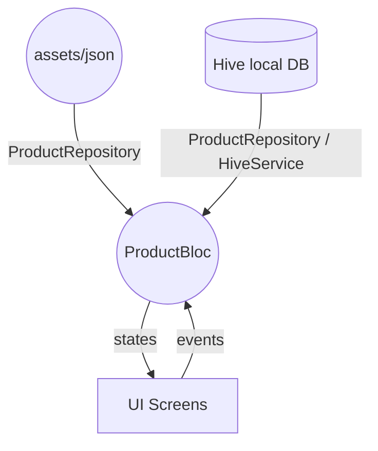

* **Presentation** – pure Flutter widgets. All screens subscribe to `ProductBloc` & emit events.
* **State Management** – [`flutter_bloc`](https://pub.dev/packages/flutter_bloc). Each UI action (search, add-to-cart, etc.) dispatches a strongly-typed event. The bloc fetches data, updates Hive and emits a new immutable `ProductState`.
* **Repository Layer** – `ProductRepository` abstracts _where_ the data comes from: JSON assets for catalog, Hive for cart & orders.
* **Services** – `HiveService` wraps `hive_flutter` providing a tiny key/value API that the repository & other screens reuse.
* **Utilities** – `NavigationService` for navigation outside widget-tree, `ThemeProvider` for theme switching, constant files for colors/images/strings.

---

## 🔄 App Flow

1. **`main.dart`** bootstraps Flutter, initializes Hive (`HiveService().initialize()`), then launches `SplashScreen`.
2. **`SplashScreen`** checks if a user profile exists in Hive.
   * If present → navigates to `HomeScreen`.
   * Else → navigates to `PersonalDetailsScreen` to capture basic user info (stored in Hive).
3. **`HomeScreen`** creates `ProductBloc` and fires `ProductRequested`.
4. **`ProductBloc`** loads the product list from `assets/json/products.json`, merges any stored cart items, then emits `ProductState.loaded`.
5. **User interactions**:
   * Search bar → `ProductSearched` (filters in repository).
   * Category chip → `ProductCategorySelected`.
   * Add to cart / quantity +/- → `ProductAddedToCart` (updates Hive & state).
6. **`CartScreen`** listens to the same bloc; UI reflects `state.cart`.
7. **Placing an order** stores the current cart in Hive under the `order` key and clears the cart.

---

## 🗄️  Data & Persistence

| Entity          | Source                                    |
|-----------------|-------------------------------------------|
| Products        | `assets/json/products.json`               |
| Cart            | Hive box `coreBox`, key `cart`            |
| Orders          | Hive box `coreBox`, key `order`           |
| User Profile    | Hive box `coreBox`, key `user`            |

> Hive is a lightweight, NoSQL database perfect for local persistence in Flutter. The wrapper `HiveService` opens a single `coreBox` and exposes `addValue`, `getValue`, `removeValue`, `clearBox` helpers used across the app.

---

## 🚀 Getting Started

```bash
# Clone the repo
$ git clone https://github.com/your-org/pocket_fm_demo.git
$ cd pocket_fm_demo

# Install dependencies
$ flutter pub get

# (Optional) run code-gen / analyze
$ flutter analyze

# Run on device or emulator
$ flutter run
```

### Running tests

```bash
flutter test
```

---

## 📂 Project Structure (excerpt)

```
lib/
  bloc/           ← BLoC, events, states
  const/          ← constants (colors, images, helpers)
  model/          ← data models (Product, Cart, User)
  repository/     ← repository classes (ProductRepository)
  service/        ← low-level services (HiveService, NavigationService)
  presentation/   ← UI screens & widgets
```

---

## 📸 Screenshots

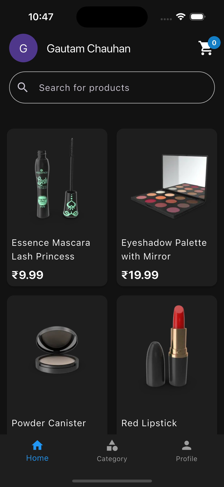
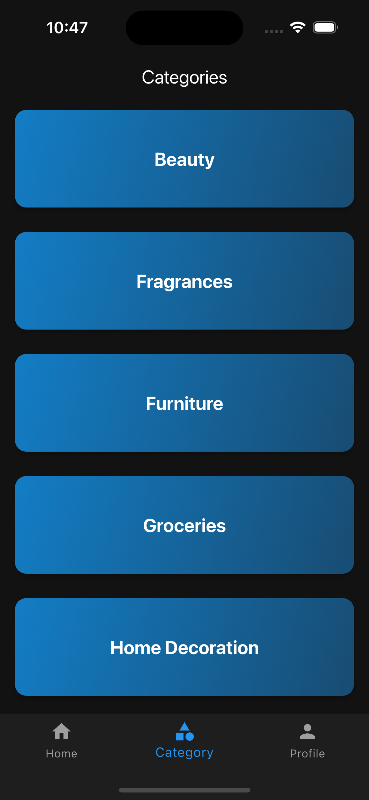
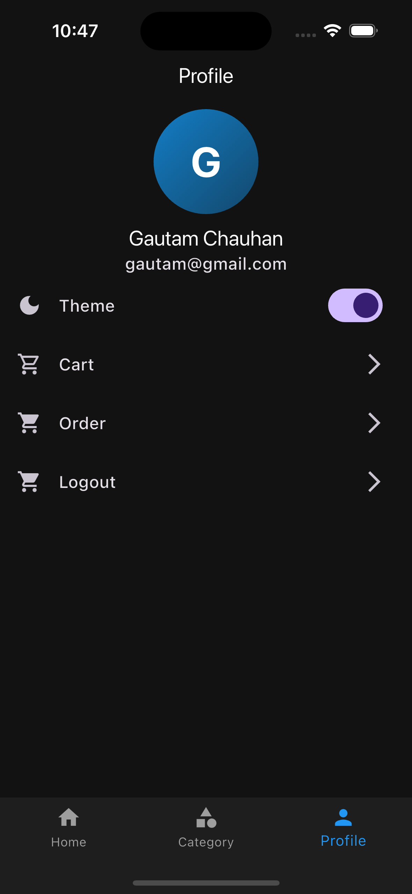
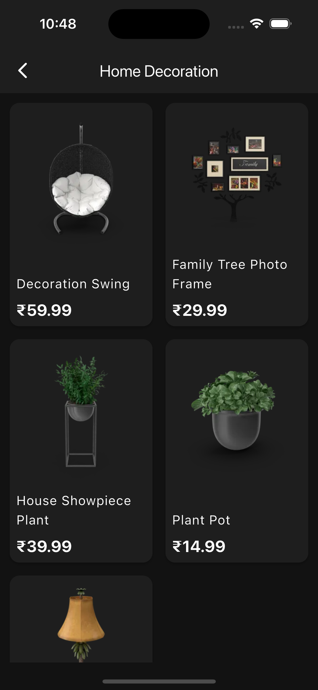
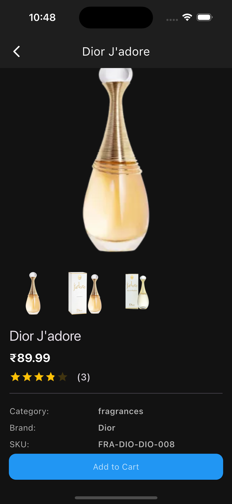
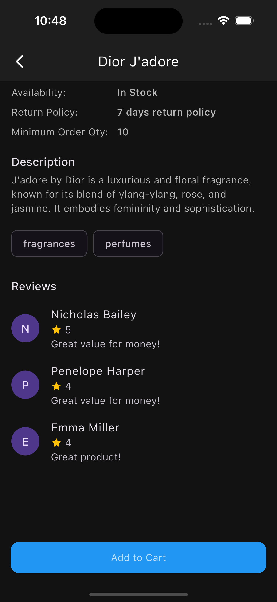
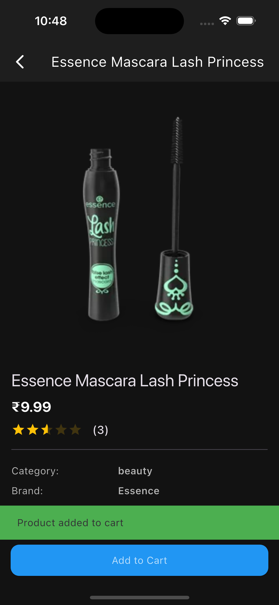
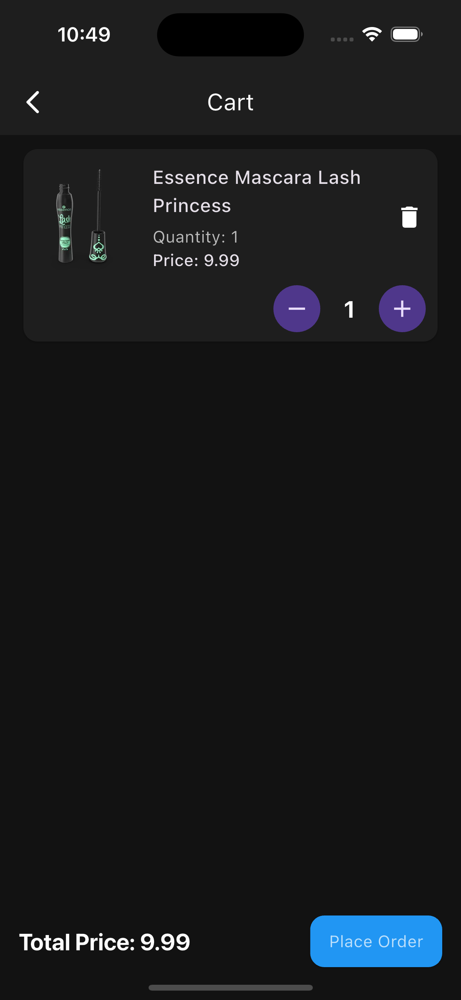
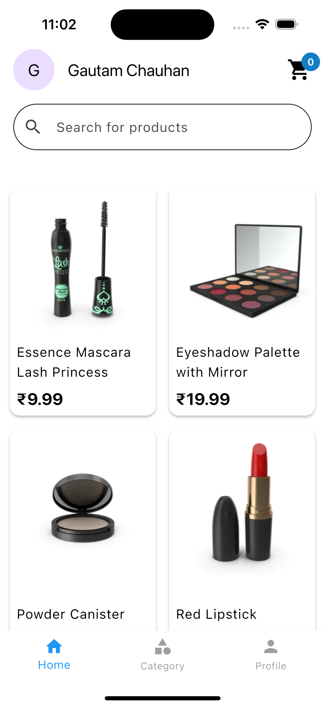
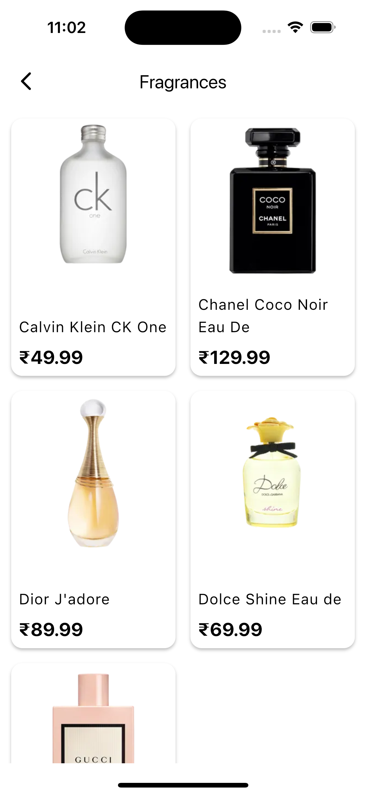
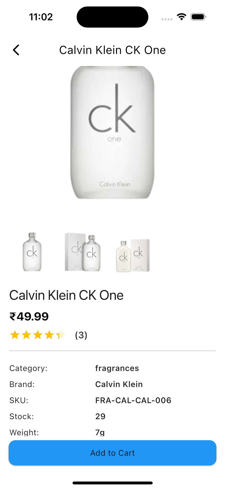
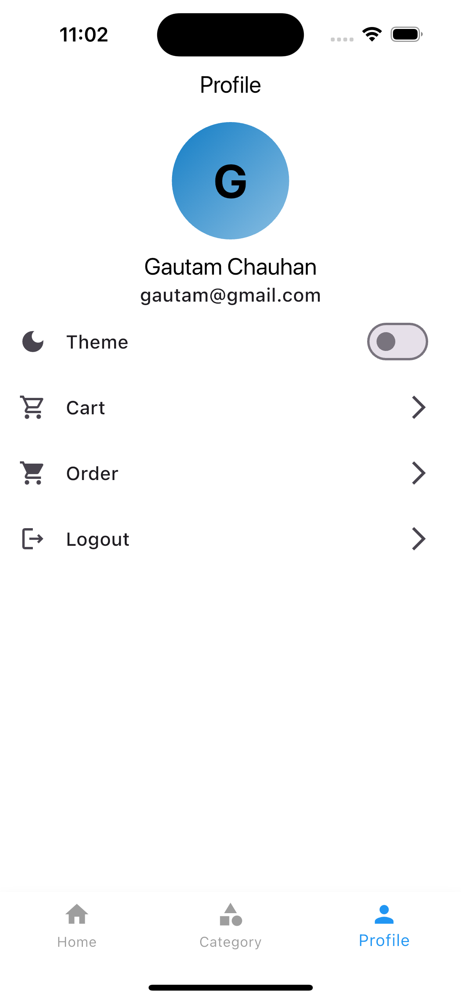
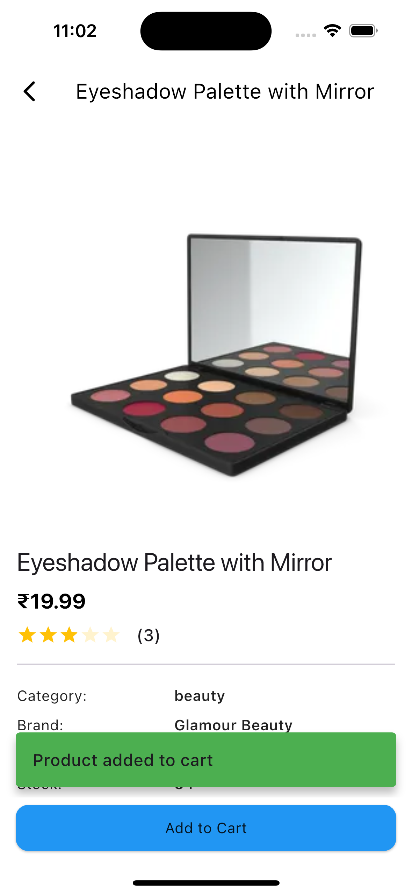
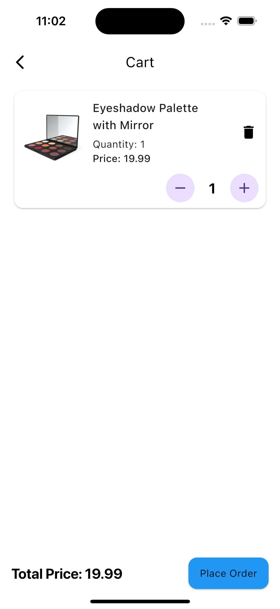

---

## 🤝 Contributing
Pull requests are welcome! Please open an issue first to discuss what you would like to change.

---

## 📄 License
Distributed under the MIT License. See `LICENSE` for more information.
